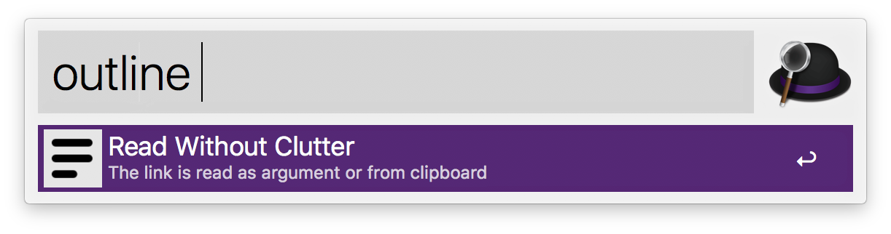

# Outline

## Workflow for the Alfred App (macOS only)

Simple workflow that prepends [https://ouline.com](https://ouline.com) to the link you passed as argument or is present on the clipboard and opens on the browser.

## About [https://ouline.com](https://ouline.com)

Its slogan is _Read Without Clutter_. It removes everything from a webpage except for its content (it is not flawless, though). It also allows to read without ads, paywalls and cookies notices.

## Flow of the workflow

You can trigger the workflow with the _outline_ keyword (you can also set a hotkey). The link you want to read may be given as argument (which is optional) or if none is present, the link is read from the clipboard. If it was read from the clipboard, then its contents are modified with the addition of the prefix `https://ouline.com`. No matter how the input was given, the workflow will open the result in your default web browser.

Here is an image of the workflow:

## Usage

## Extra

The workflow currently does not use it, but there is a python script that compresses some of the logic of the workflow. More advanced users may custom it to their usage. Here it is:

## Disclaimer

I do not have any kind of affiliation to [https://ouline.com](https://ouline.com) and this is not an official product.
